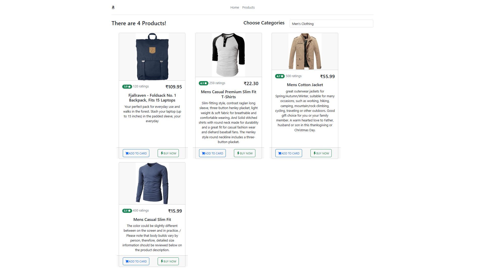

# EStore

## Details

Used [Fake Store API](https://fakestoreapi.com/) and Angluar 17 to develop this project.

## Steps to execute this project

- Clone the Repo `git clone https://github.com/SanjuCse/EStore`.
- Run Project Through `ng serve -o`

## References

- [Fake Store API](https://fakestoreapi.com/)
- [Angular 17](https://angular.io/)
- [VS Code](https://code.visualstudio.com/)
